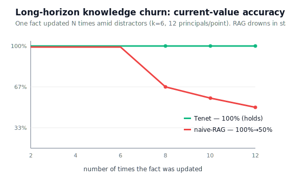
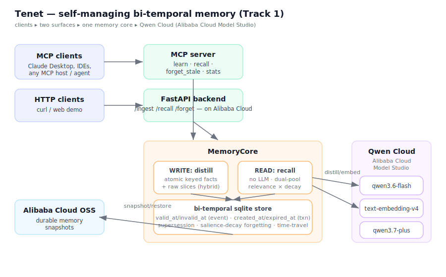

<div align="center">

<picture>
  <source media="(prefers-color-scheme: dark)" srcset="docs/brand/banner-dark.svg">
  
</picture>

<p>
  <a href="paper/tenet.pdf"><b>📄 Paper</b></a> ·
  <a href="docs/BENCHMARK.md"><b>Benchmarks</b></a> ·
  <a href="docs/COMPARISON.md"><b>vs Mem0 / Zep / Letta</b></a> ·
  <a href="src/tenet/mcp_server.py"><b>MCP server</b></a> ·
  <a href="scripts/demo_agent.py"><b>Demo</b></a>
</p>

[](https://github.com/Nas01010101/tenet/actions/workflows/test.yml)
[](paper/tenet.pdf)
[](LICENSE)
[](#quickstart)
[](https://qwencloud-hackathon.devpost.com)
[](src/tenet/mcp_server.py)
[](https://github.com/Nas01010101/tenet/stargazers)

*Memory reads shouldn't cost an LLM call.*

```bash
pip install tenet-memory   # not yet on PyPI — until it lands, install from source (below)
```
```python
from tenet import Tenet

mem = Tenet()
mem.ingest("I live in Boston")              # needs an LLM key (distills the raw message)
mem.ingest("I moved to Seattle")            # supersedes — Boston kept in history
mem.recall("where do I live?")              # → [Seattle]  (current beliefs, no LLM call)
mem.recall("where do I live?", as_of=t0)    # → [Boston]   (time-travel, no LLM call)
mem.navigate("where do I live and work?")   # → adaptive multi-hop recall, no LLM call
```
`recall` / `stats` / `doubts` / time-travel (`recall(as_of=...)`) / `navigate` are **LLM-free** —
embeddings + cosine + closed-form math only, low-milliseconds, and with `EMBED_PROVIDER=local`
none of them need an API key at all. `ingest` (and the chat agent) need a working
`DASHSCOPE_API_KEY` (or `LLM_PROVIDER=openrouter` + `OPENROUTER_API_KEY`) since turning free-form
text into atomic facts is the one judgment call that needs a model — see
[the 60-second zero-key demo](#quickstart) below for exactly where that line sits.

</div>

---

## Memory reads shouldn't cost an LLM call

Most agent-memory systems architect the *read* path around an LLM in the loop — a rerank
call, a synthesis pass, an agent deciding what to fetch next. **Tenet's bet is the opposite:**
`recall`, `doubts`, time-travel (`recall(as_of=...)`), and the adaptive multi-hop `navigate()` are pure vector
similarity + closed-form math, so they cost no API call and no inference latency — the thing
that *does* need judgment (turning a raw message into atomic, keyed facts) happens once, at
**write time** (`ingest`), not on every read. Supersession itself — the mechanism that keeps
answers correct as facts change — is deterministic bi-temporal bookkeeping; no model is in that
loop either.

LLM-agent memory is almost always **retrieval over a log of past turns**. That's the wrong
abstraction for an agent modeling a *changing* world: as a fact is updated over a long
interaction — **knowledge churn** — stale versions crowd the retrieval budget and the agent
answers with an out-of-date value. **Tenet** reframes memory as a **self-consistent belief
state** — a compact *world model of the user* — and stays correct where retrieval collapses.

<div align="center">


<sub>Real recorded session: facts change, the belief state supersedes them, time-travel recalls what was true before — and the read path never calls an LLM.</sub>

</div>

## The failure mode nobody benchmarks

<div align="center">



**As a fact is updated 2→12 times, RAG-memory falls 100%→50%. Tenet holds 100%.**

</div>

## Why it's different

| | retrieval memory (RAG) | **Tenet** |
|---|---|---|
| abstraction | document index of turns | **belief state (world model)** |
| a changed fact | two similar passages | **superseded** (bi-temporal, history kept) |
| stale evidence | retrieved forever | **retired** (belief–evidence consistency) |
| write policy | store everything | **surprise-gated** (predictive coding) |
| forgetting | none (grows forever) | salience-decay sweep |
| fact drift | unmodeled | **learned hazards** — P(still valid) per attribute, `tenet doubts` |
| queryable across time | no | **time-travel** (`recall(as_of=t)`) |
| multi-hop bridging | fixed-depth *k*, or none | **adaptive `navigate()`** — deepens hops only while new evidence clears a relevance-gain gate, LLM-free |
| read path | — | **no LLM call** |

Read the 2-page paper: **[`paper/tenet.md`](paper/tenet.md)**.

## Quickstart

### 1. 60 seconds, no API key

```bash
pip install tenet-memory[local]             # bge-small embedder, CPU — no network call at all
python examples/00_zero_key_demo.py         # supersession + time-travel + doubts, zero LLM calls
```
Walks the entire LLM-free read path end to end — recall, supersession, time-travel, and the
learned-dynamics `doubts` — against a pre-formed fact ledger. The one thing it *can't* show is
`ingest()` turning free-form conversation into those facts; that's the one call in Tenet that
needs a model (next step).

### 2. The full agent (needs an API key)

```bash
cp .env.example .env && chmod 600 .env      # add DASHSCOPE_API_KEY (Qwen Cloud)
pip install -e ".[all]"                     # base + api/mcp/oss/local/cli/langgraph extras
python scripts/smoke_test.py                # verify connectivity
uvicorn tenet.api:app --host 0.0.0.0 --port 8000  # HTTP API incl. POST /chat
python -m tenet.mcp_server                   # or the MCP server (learn/recall/navigate/forget/stats)
```
`pip install -e .` alone only pulls the base library (`openai`, `numpy`) — the API server and
MCP server need the `api`/`mcp` extras (bundled in `[all]` above), or install just what you need,
e.g. `pip install -e ".[api]"`. No key yet? `tenet recall` / `tenet navigate` / `tenet stats` /
`tenet doubts` work fully offline with `EMBED_PROVIDER=local` (installs `sentence-transformers`,
no network call at all); `tenet remember` / `tenet chat` / the MCP `learn` tool need a real
`DASHSCOPE_API_KEY` (or `LLM_PROVIDER=openrouter`) since they distill text with an LLM call —
without one you'll see a clear "memory write failed: ..." error rather than a silent no-op.

More in [`examples/`](examples/) — zero-key demo, quickstart, assistant loop, MCP client,
LangChain adapter, LangGraph `BaseStore` adapter.

**Works with:** any MCP client ([Claude Desktop](examples/03_mcp_client.md), IDEs, other
agents) · [LangChain](examples/04_langchain_memory.py) via a thin `TenetMemory` adapter ·
[LangGraph](examples/05_langgraph_store.py) via a `BaseStore` adapter (below) · plain HTTP
(`tenet.api:app`, `POST /chat`).

### LangGraph `BaseStore` adapter

Tenet drops in as a LangGraph [`BaseStore`](https://langchain-ai.github.io/langgraph/reference/store/)
— the interface `StateGraph.compile(store=...)` expects — so a LangGraph agent's long-term memory
gets bi-temporal supersession for free: re-`put()`-ting a `(namespace, key)` retires the old
value to history instead of overwriting it, the same mechanism `Tenet.ingest()` uses.

```bash
pip install tenet-memory[langgraph]
```
```python
from tenet.integrations.langgraph import TenetStore

store = TenetStore(db_path="data/agent.db")
store.put(("users", "alex"), "residence", {"city": "Montreal"})
store.put(("users", "alex"), "residence", {"city": "Toronto"})  # supersedes, not overwritten
store.get(("users", "alex"), "residence").value                # -> {"city": "Toronto"}
```
Full example (put/get/search/delete/list_namespaces): [`examples/05_langgraph_store.py`](examples/05_langgraph_store.py).

## Results

LongMemEval_S (n=40, gpt-4o reader) — honest, reproducible; full detail in
[`docs/BENCHMARK.md`](docs/BENCHMARK.md).

> **Note:** the shipped product runs **entirely on Qwen Cloud** (`text-embedding-v4`,
> `qwen3.6-flash`, `qwen3.7-plus`). `gpt-4o`/`gpt-4o-mini` appear below **only as frozen
> evaluation readers**, to match the exact protocol Mem0/Zep/MemoryAgentBench publish
> against — apples-to-apples with the published leaderboards.

Tenet is a **frontier, not a point** — one `expand` knob trades tokens for accuracy:

| | mode | recall@10 | QA acc | reader tokens | **acc / 1k tok** |
|---|---|---:|---:|---:|---:|
| full-context | — | — | 65% | ~124,000 | 0.5 |
| RAG | top-*k* turns | 95% | 57.5% | 2,101 | 27.4 |
| **Tenet** | efficiency | **97.5%** | 52.5% | **1,067** | **49.2** ← best/token |
| **Tenet** | parity | **97.5%** | **57.5%** | 2,083 | 27.6 |

- **Matches strong RAG on one-shot accuracy at equal-or-lower tokens** (57.5% = 57.5%, gpt-4o) —
  belief-anchored evidence expansion closed the gap belief-only compression left open. On a
  `gpt-4o-mini` reader the parity point edges ahead (60.0 vs 55.0).
- **Best accuracy-per-token** at the efficiency point (1.6× RAG at *half* its context) — and
  **reader-robust** across `gpt-4o-mini` / `gpt-4o` / `claude-opus-4.8` (≈1.6–1.7×).
- **Churn-robust:** 100% at every update level while RAG collapses to 50% — the collapse holds
  under a gpt-4o reader, so it's *structural*, not reader weakness.
- **Ablation:** the belief–evidence consistency rule alone lifts current-value accuracy 55%→100%.
- **Honest:** the one category still behind RAG is multi-session synthesis (42.9 vs 57.1, up
  from 28.6). We report it. *(Eval off-Qwen, one seed, reader noise ≈±5–7pp; shipped system uses Qwen Cloud.)*

### 🏆 Standardized: MemoryAgentBench FactConsolidation (ICLR 2026, all 800 questions)

Conflict resolution — the axis famous memory systems fail hardest (original table: **Zep 7%,
Mem0 18%, MemGPT 28%** single-hop; **≤7%** multi-hop for all 22 systems):

| pooled 6K–262K | naive-RAG | **Tenet** | published SOTA (mini / gpt-4o) |
|---|---:|---:|---:|
| single-hop | 47.8 | **86.5** [82.8, 89.5] | 78.0 / 94.8 |
| multi-hop | 4.5 | **30.2** [26.0, 34.9] | 30.2 / 51.5 |

**Above the published mini-tier single-hop SOTA and tied on multi-hop — with a local 7B
backbone and *zero-LLM* deterministic ingestion.** SubEM + official prompt verbatim; Wilson
CIs; no length collapse (SH ≥81% at every haystack size). Details: [`docs/BENCHMARK.md`](docs/BENCHMARK.md) §6.

**MAB Accurate-Retrieval** (~2,000 questions over 197K–534K-token contexts, official
per-benchmark metrics, matched gpt-4o-mini reader): AR average **59.3** — second only to
HippoRAG-v2 (65.1, which runs LLM OpenIE over every context token; Tenet ingests with
**embeddings only**), 20+ points above Mem0 (32.6) / Zep (37.5) / MemGPT, and **beats the
field on EventQA (70.7 vs 67.6, CI excludes)**. RULER MH is the honest loss (45 vs 66).
Details: [`docs/BENCHMARK.md`](docs/BENCHMARK.md) §7.

## The agent

Tenet ships as a personal assistant ([`src/tenet/agent.py`](src/tenet/agent.py)) on Qwen Cloud:
```
you › Hi! I'm Alex, I live in Montreal and work as a data analyst.
assistant › Nice to meet you, Alex! How's the analyst work in Montreal?   [remembered 2 facts]
… weeks later …
you › I moved to Toronto and got promoted to senior analyst!
you › Where do I live and what's my job now?
assistant › You live in Toronto and you're a senior analyst. Congrats on the promotion!
```
```bash
python -m tenet.agent          # interactive assistant (or: tenet-agent)
python scripts/demo_agent.py   # the scripted story (video walkthrough)
```

## Architecture


Two layers over one bi-temporal store (beliefs + evidence), two surfaces (MCP + HTTP),
powered by Qwen Cloud (Alibaba Cloud Model Studio). One-page component diagram + key
equations + the annotation-only invariant story: [`docs/ARCHITECTURE.md`](docs/ARCHITECTURE.md).
Original scoping: [`docs/DESIGN.md`](docs/DESIGN.md); positioning vs Mem0/Zep/Letta/Mastra:
[`docs/COMPARISON.md`](docs/COMPARISON.md).

## Reproduce the paper
Every benchmark is one CLI command — provider preset + config + git-sha logged to
`data/bench_runs.jsonl`. `tenet bench run` dispatches to the `scripts/bench_*.py` that
produce the paper numbers (the source of truth); it never reimplements them.
```bash
tenet bench list                        # all benchmarks + which figure/§ each reproduces
tenet bench run <name> --dry-run ...     # print the exact command+env, run nothing
tenet bench results                     # table of past runs

python scripts/test_memory.py ; python scripts/test_tenet_e2e.py                  # capabilities
tenet bench run churn --provider ollama --principals 12 --k 6 --updates 2,4,6,8,10,12   # Fig.1 churn
tenet bench run lme-recall --provider openrouter --limit 40 --k 10 --seed 2 --qa            # efficiency point
tenet bench run lme-recall --provider openrouter --limit 40 --k 10 --seed 2 --qa --expand 20  # parity point
tenet bench run knowledge-update --provider ollama --principals 4                 # supersession ablation
```
`--provider` presets: `ollama` (fully offline: local embeddings + qwen2.5:7b reader),
`openrouter` (local embeddings + gpt-4o-mini reader), `local` (embeddings only),
`qwen` (Qwen Cloud). Full matrix + read-path perf analysis: [`docs/BENCHMARK.md`](docs/BENCHMARK.md), [`docs/HARNESS.md`](docs/HARNESS.md).

## Repository
```
paper/tenet.md tenet_full.pdf   the paper (2-page + full preprint)
src/tenet/  core.py memory.py distill.py config.py   the belief-state memory engine
            navigate.py                               adaptive LLM-free multi-hop recall
            agent.py                                  the assistant
            mcp_server.py api.py alicloud_oss.py      surfaces + Alibaba Cloud deploy
            integrations/langgraph.py                 LangGraph BaseStore adapter
examples/   00_zero_key_demo.py 01_quickstart.py 02_assistant.py 04_langchain_memory.py
            05_langgraph_store.py                     zero-key demo, quickstart, assistant loop,
                                                        LangChain + LangGraph adapters
scripts/    demo_agent.py    video walkthrough
            bench_horizon.py bench_factcon.py bench_mab_ar.py lme_recall.py   benchmarks
            test_memory.py test_dynamics.py test_agent_uncertainty.py test_errors.py
            test_langgraph_store.py test_navigate.py test_tenet_e2e.py smoke_test.py   tests
docs/ BENCHMARK.md COMPARISON.md DESIGN.md DEPLOY.md  architecture.svg horizon.svg
```

## Citation
```bibtex
@misc{tenet2026,
  title  = {Tenet: Agent Memory as a Self-Consistent World Model},
  author = {Anas},
  year   = {2026},
  note   = {Global AI Hackathon with Qwen Cloud, Track 1},
  url    = {https://github.com/Nas01010101/tenet}
}
```

## Origin
Tenet started as a [Global AI Hackathon with Qwen Cloud](https://qwencloud-hackathon.devpost.com)
(Track 1: MemoryAgent) entry — hackathon materials live in [`docs/hackathon/`](docs/hackathon/).

## License
MIT — see [LICENSE](LICENSE).
