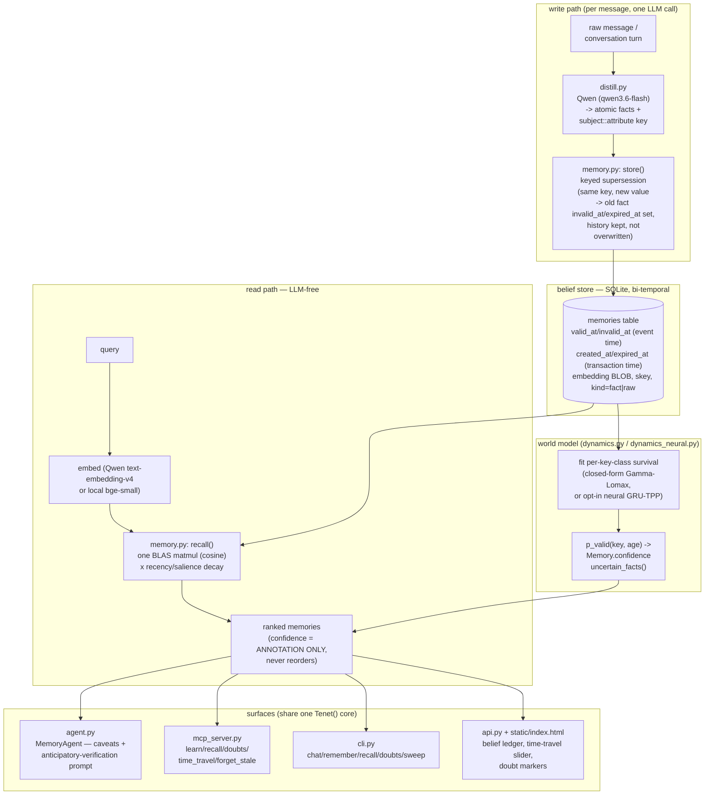

# Architecture

One page: how a message becomes a belief, how a belief decays and doubts itself, and
where every surface (agent / MCP / CLI / web) plugs into the same core.

## Component diagram



## The bi-temporal store

Every fact carries two independent time axes:

- **event time** (`valid_at` / `invalid_at`) — when the fact is true *in the world*.
- **transaction time** (`created_at` / `expired_at`) — when the system *learned* it.

Supersession sets `invalid_at`/`expired_at` on the old row instead of overwriting it, so
`recall(as_of=t)` can answer "what did I believe on date t" while default `recall()`
returns only currently-true facts (`expired_at IS NULL`). This is the mechanism behind
`time_travel` — implemented once in `memory.py:_rows_as_of`, exposed identically over the
library, the CLI (`tenet recall --as-of`), and MCP (`time_travel(query, as_of)`).

## The world-model layer — key equations

`dynamics.py` treats the ledger as a *training set for how facts change*: every
superseded fact is an observed lifetime, every current fact a right-censored one. Per
key **class** (the attribute half of `subject::attribute` — e.g. `residence`, `mood`),
a conjugate Gamma(a, b) posterior over the change rate gives a closed-form
posterior-predictive survival function:

```
S(dt | class) = (b_post / (b_post + dt)) ** a_post
a_post = a0 + n_supersessions
b_post = b0 + total_exposure_seconds
```

so `P(fact still valid)` is *learned per attribute* — `residence` learns a slow hazard,
`mood` a fast one, automatically, from that store's own history (weak prior: mean
lifetime ~90d, ~2 weeks of pseudo-exposure, so a handful of real observations dominates
it). A second **ripple** term captures correlated change: `P(class B superseded within a
7-day window | class A just superseded)`, Laplace-smoothed from co-supersession counts.
When a correlated class changes, the survival exponent is raised by `(1 + ripple_bump)`,
so `p_valid` drops *before* the correlated fact itself is directly contradicted (e.g. a
residence change quietly casts doubt on `job`). An opt-in neural alternative
(`dynamics_neural.py`, a 276k-parameter GRU temporal-point-process trained on GPU,
numpy-only at inference — `TENET_DYNAMICS=neural`) replaces the closed-form fit when a
richer, value-conditioned hazard is worth the extra weight; the closed-form model is the
default and requires no training step.

## The annotation-only invariant

**Confidence must never change which memories are recalled or their rank.** It can only
change how a fact is *worded* once it's already been selected on its normal
relevance-times-decay score.

This was learned the hard way: the first version of the world-model integration
rank-demoted doubted facts (multiplying score by `p_valid`), and the controlled
knowledge-churn benchmark — where memory is supposed to *dominate* naive RAG — collapsed
from **100% → 33%**. A frequently-updated fact (e.g. `mood`, churned every couple of
days) is *exactly* the fact with a low learned `p_valid` — and it is also, by
construction, the most relevant, most current answer to "what is the user's mood right
now." Demoting it by confidence re-created RAG's own failure mode: crowding the
top-k with stale-but-more-"certain" versions instead of surfacing the current truth.
The fix — and the invariant now enforced everywhere confidence is touched
(`memory.py:recall`, `list_beliefs`, `agent.py`, `mcp_server.py`) — restored it to
**100%** by moving confidence to `Memory.confidence`, a field attached *after* ranking
and used only for hedging language, a doubt list, and UI markers. This ordering
(annotate, don't gate) is also enforced by a regression test
(`scripts/test_agent_uncertainty.py::test_ranking_invariant`), which monkeypatches
`p_valid` to two wildly different regimes and asserts identical `recall()` order.

## Module map

| File | Role |
|---|---|
| `core.py` | `Tenet` — the one interface: `ingest`/`ingest_session` (write), `recall` (read), passthroughs for `forget_sweep`/`uncertain_facts`/`stats`. |
| `memory.py` | `MemoryCore` — the bi-temporal SQLite store: `store()` (supersession/dedup/surprise-gate), `recall()` (BLAS matmul + decay + dual-pool fact/raw selection + belief-anchored/associative expansion), `list_beliefs()` (UI), `forget_sweep()`. |
| `dynamics.py` | Closed-form world model: Gamma-Lomax per-key-class survival + ripple, `p_valid()`, `uncertain_facts()`, `expected_lifetime_days()`. |
| `dynamics_neural.py` | Opt-in GRU temporal-point-process world model — numpy-only inference from a trained `.npz`, no torch import at runtime. |
| `distill.py` | Write-time LLM distillation (Qwen) — raw message → atomic facts with `subject::attribute` keys and salience. |
| `agent.py` | `MemoryAgent` — recall → caveat low-confidence facts → answer (Qwen) → ingest what was said; session-start anticipatory-verification line from `uncertain_facts()`. |
| `mcp_server.py` | MCP tools: `learn`, `remember`, `recall` (annotated with `p_valid`), `doubts`, `time_travel`, `forget_stale`, `memory_stats`. |
| `cli.py` | `tenet` console script: `chat/remember/recall/stats/doubts/sweep/serve-mcp/serve-api`. |
| `api.py` | FastAPI HTTP surface + the belief-ledger demo UI (`static/index.html`), session-isolated. |
| `config.py` | Provider abstraction (Qwen Cloud default; OpenRouter/Ollama for offline dev) + `.env` loader. |
| `alicloud_oss.py` | Optional Alibaba Cloud OSS snapshots (durability / proof-of-Alibaba-Cloud-services). |
| `bench_cli.py` | `tenet bench` — dispatcher over `scripts/bench_*.py` (never reimplements a benchmark). |

See also: `docs/DESIGN.md` (original scoping), `docs/BENCHMARK.md` (every number,
reproducible), `docs/SOTA.md` (positioning), `docs/COMPARISON.md` (vs Mem0/Zep/Letta),
`paper/tenet.md` (2-page paper).
