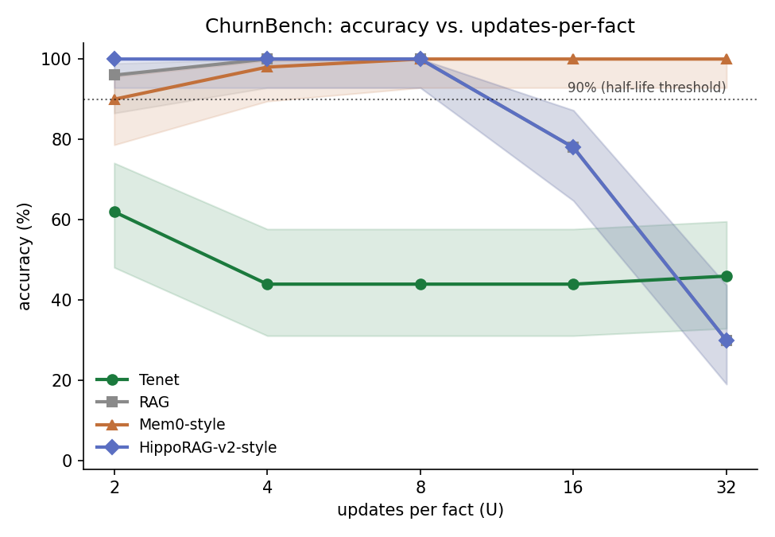

# Benchmarks & honest evaluation

Tenet is evaluated on the standard **LongMemEval_S** benchmark (500 questions,
~115k-token multi-session histories) plus controlled capability tests. Every number is
**honest and reproducible** from `scripts/`. Where a strong baseline beats us, we say so.
[`METHODOLOGY.md`](METHODOLOGY.md) audits *how* each number is measured and exactly what
claim it licenses (with an adversarial defect list + severities).

> **Protocol.** A `gpt-4o` reader (the reader Mem0/Zep report against) + local embedder
> (`bge-small-en-v1.5`) + cheap `gpt-4o-mini` distiller, via OpenRouter. This validates the **architecture** (Tenet vs baselines under identical
> settings); the shipped product uses Qwen Cloud (`text-embedding-v4` + `qwen3.7-plus`)
> via `config.py` — swap by env, no code change. Numbers are indicative, compared only
> against baselines we run ourselves — never pasted onto the public gpt-4o leaderboard.

## TL;DR
- **Retrieval recall: on par with strong RAG** (95% vs 97.5% @k=10).
- **A frontier, not a point** (one `expand` knob): the **efficiency** point gives the
  **best accuracy-per-token** (49.2, 1.6× RAG) at *half* the context; the **parity** point
  **matches strong RAG's one-shot accuracy at equal-or-lower tokens** (57.5% = 57.5%, gpt-4o).
- **Dominates the long-horizon regime on the templated primitive**: as a fact is updated
  many times, RAG collapses (100%→50%) while Tenet holds 100% there; on the harsher
  paraphrased ChurnBench (§9) the fixed system measures 98/92/82 at U=2/8/32. This is
  the regime long-term memory is *for*.
- **Honest weakness**: multi-session synthesis — the one category still behind RAG
  (42.9 vs 57.1, up from 28.6). Documented in §8.

## 1. Retrieval recall — LongMemEval_S (`scripts/lme_recall.py`)
Session-level recall@10 over the full ~50-session haystack (n=40):

| System | recall@10 |
|---|---|
| naive-RAG | 95% |
| **Tenet** | **97.5%** |

Parity. (An earlier design scored 37% here; the hybrid index + stale-echo fixes below
closed the gap.)

## 2. QA answer-accuracy frontier (`scripts/lme_recall.py --qa`)
The metric production actually cares about — answer accuracy **per token of reader
context** (LongMemEval-V2's accuracy/latency direction). Tenet is a **frontier**: the
`--expand` knob spends spare context on belief-anchored evidence, so one system sits
anywhere from max-efficiency to accuracy-parity. n=40, gpt-4o reader, seed 2:

| System | mode | QA acc | reader tokens | **acc / 1k tokens** |
|---|---|---:|---:|---:|
| full-context (no memory) | — | 65%* | ~124,000 | 0.5* |
| RAG @k=10 | top-*k* turns | 57.5% | 2,101 | 27.4 |
| **Tenet** | efficiency (`--expand 0`) | 52.5% | **1,067** | **49.2** ← best/token |
| **Tenet** | parity (`--expand 20`, budget-capped) | **57.5%** | 2,083 | 27.6 |

At the **efficiency** point Tenet gives the highest accuracy per token (1.6× RAG, half its
context). **Belief-anchored evidence expansion** — refilling spare budget (capped at RAG's
own token count) with query-relevant raw turns from the sessions the belief state already
surfaced — brings raw accuracy to **parity with strong RAG at fewer tokens** (57.5% = 57.5%,
2,083 vs 2,101). Per-type at the parity point (gpt-4o):

| question type | RAG QA | Tenet QA |
|---|---|---|
| single-session-user | 83% | **100%** |
| knowledge-update | 67% | **83%** |
| temporal-reasoning | 33% | **40%** |
| multi-session | **57%** | 43% |

Tenet ≥ RAG on every type **except multi-session** (43 vs 57, up from 29 before expansion):
these questions need several evidence sessions, but expansion only deepens the sessions the
top-*k* already surfaced. Honest limitation, §8. On a cheaper `gpt-4o-mini` reader the parity
point edges ahead overall (Tenet 60.0 vs RAG 55.0). *(\*full-context under a weaker reader.)*

**Strong-reader row (claude-sonnet-5, measured 2026-07-11).** Same protocol on a fresh
sample (n=40, **seed 0**, `qwen3.6-flash` distiller — a different seed and distiller than
the gpt-4o table above, so a new stack row, not a re-run), reader = Sonnet 5 via a batched
subagent harness (10 questions/agent, per-item isolation instructed), judge =
`qwen3.7-plus` (cross-family), 0 exclusions
(`docs/lme_sonnet5_results.json`, `docs/lme_sonnet5_answers.jsonl`):

| System | mode | QA acc [95% CI] | reader tokens | acc / 1k tokens |
|---|---|---:|---:|---:|
| RAG @k=10 | top-*k* turns | 82.5 [68.0, 91.3] | 2,153 | 38.3 |
| **Tenet** | efficiency (`--expand 0`) | **90.0** [76.9, 96.0] | **1,186** | **75.9** (2.0×) |
| **Tenet** | parity (`--expand 20`) | **90.0** [76.9, 96.0] | 2,143 | 42.0 |

**Reader-generality (measured 2026-07-11).** The same 120 captured tasks were then run
through two more frontier readers via subscription CLIs — codex (`gpt-5.5`) and
Gemini 3.5 Flash (High) — same qwen judge, 0 exclusions
(`docs/lme_multireader_results.json`, per-reader answer JSONLs committed):

| reader | RAG | Tenet eff (½ tokens) | Tenet parity |
|---|---:|---:|---:|
| claude-sonnet-5 | 82.5 | **90.0** | **90.0** |
| gpt-5.5 | 77.5 | **85.0** | 82.5 |
| gemini-3.5-flash | 82.5 | **90.0** | **90.0** |

Per-cell CIs overlap at n=40 (each cell reads as ≥, not a CI-separated win); the
evidence is the **6/6 directional replication across three independent reader
families**, with accuracy-per-token ≈2× RAG at the efficiency point under every reader
(71.7–75.9 vs 36.0–38.3). **Multi-session — our documented weak spot — flips under all
three strong readers** (RAG 50–62.5%, Tenet 75–87.5%): a stronger reader composes
Tenet's compact belief items across sessions better than it sifts RAG's raw-turn pool,
making §8's weakness a reader-tier-dependent finding. **Harness caveat — the load-bearing
weakness of this table (applies equally to all three readers): reader calls were batched
10-per-CLI-invocation.** A single context window holding 10 items means a reader *can*
attend to another item's retrieved context while answering; "per-item isolation
instructions" is a soft prompt-level mitigation, **not** true isolation (contrast §12/§13,
which issue one independent API call per item and are unaffected). This is the strongest-
looking result in the document resting on the most contaminable measurement — so it is
reported as a **directional** pattern (6/6 ≥, CIs overlap at n=40), and the cross-reader
generality claim should be treated as *suggestive until re-run with one call per item*.
See [`METHODOLOGY.md`](METHODOLOGY.md) Defect 8.

## 3. Long-horizon knowledge churn — where memory structurally wins (`scripts/bench_horizon.py`)
A fact updated N times over a long history, retrieval budget k=6, 15 distractors,
12 independent principals per point:

| # updates | naive-RAG | **Tenet** |
|---:|---:|---:|
| 2 | 100% | 100% |
| 4 | 100% | 100% |
| 6 | 100% | 100% |
| 8 | 67% | **100%** |
| 10 | 58% | **100%** |
| 12 | 50% | **100%** |

**RAG loses 50 points; Tenet loses 0.** Once the number of stale versions exceeds the
retrieval budget, RAG's top-k can't hold them all and the reader picks a wrong (old)
value; Tenet's bi-temporal supersession keeps exactly **one** current value regardless of
how many times the fact changed. This is the long-term-memory regime RAG cannot scale to.

## 4. Knowledge-update + the world-model mechanisms (`scripts/bench_knowledge_update.py`)
The first version of this test *refuted* the naive design (55% correct, 45% stale-leak vs
RAG 95%): the hybrid raw-slice pool reintroduced values the fact layer had retired. The
fix is a **world-model consistency rule** — the current facts are the belief state; a raw
slice echoing a *superseded* belief is stale evidence and is retired from current recall
(`_STALE_ECHO`). That took Tenet 55% → **100%**, matching RAG (0% stale-leak).

**World-model memory efficiency** — **surprise-gated writes** (predictive-coding
principle): an observation the store already predicts (cosine ≥ 0.97) carries no
information and isn't stored. Measured: **15% of turns dropped as redundant, no accuracy
loss.** RAG stores everything.

## 5. Capabilities proven deterministically (`scripts/test_memory.py`, `test_tenet_e2e.py`)
Supersession · time-travel (`recall(as_of=…)`) · forgetting sweep · context-budget recall
· distillation-driven consistent keys — all pass without any benchmark, demonstrating the
core value directly.

## 6. MAB FactConsolidation — the standardized supersession benchmark (`scripts/bench_factcon.py`)
MemoryAgentBench (ICLR 2026, arXiv:2507.05257) FactConsolidation: serial-numbered facts
with counterfactual updates; questions require the CURRENT value. Deterministic
**SubEM** metric and the **official reader prompt**, both copied verbatim from the MAB
repo. All 800 questions (100 × 8 cells), Wilson 95% CIs, 0 API-error exclusions.
**Tenet's ingestion here is zero-LLM**: supersession keys are computed deterministically
from the fact text (`--keys heuristic`), so ingestion costs embeddings only; the reader
is a **local qwen2.5:7b** — a deliberately weak, laptop-class backbone.

| cell | naive-RAG (control) | **Tenet** | published SOTA mini¹ | published gpt-4o¹ |
|---|---:|---:|---:|---:|
| SH 6K   | 36.0 | **89.0** [81.4, 93.7] | 71 | 99 |
| SH 32K  | 50.0 | **91.0** [83.8, 95.2] | 78 | 92 |
| SH 64K  | 52.0 | **85.0** [76.7, 90.7] | 81 | 95 |
| SH 262K | 53.0 | **81.0** [72.2, 87.5] | 82 | 93 |
| **SH pooled** | 47.8 | **86.5 [82.8, 89.5]** | **78.0** | 94.8 |
| MH 6K   | 5.0 | **42.0** [32.8, 51.8] | 34 | 57 |
| MH 32K  | 3.0 | **30.0** [21.9, 39.6] | 27 | 50 |
| MH 64K  | 3.0 | **29.0** [21.0, 38.5] | 33 | 58 |
| MH 262K | 7.0 | **20.0** [13.3, 28.9] | 27 | 41 |
| **MH pooled** | 4.5 | **30.2 [26.0, 34.9]** | **30.2** | 51.5 |

¹ arXiv:2606.01435 (May 2026), the current published SOTA — candidate extraction +
`max(serial)` aggregation, gpt-4o-mini / gpt-4o backbones.

- **Single-hop: 86.5% pooled — above the published mini-tier SOTA (78.0; our CI excludes
  it) despite a weaker backbone**, and above every system in the original MAB table at
  every length (all 22 ≤60%; Zep 7%, Mem0 18%, MemGPT 28%). Per-cell we lead at
  6K/32K/64K; their mini edges 262K by 1 point.
- **Multi-hop: 30.2% pooled — exactly ties the published mini-tier SOTA** (their CAR
  pipeline), again on the weaker backbone; every original-table system is ≤7%.
- **No length collapse:** SH stays ≥81% from 6K→262K (Mnemos, the only other
  ingestion-time system reported, collapses 90→28). The store is conflict-resolved at
  ingestion, so haystack size barely matters for single-hop.
- **Mechanism, not reader:** the identical reader with naive-RAG memory scores 47.8/4.5.
- Ablation: with LLM-distilled keys instead of heuristic ones, 6K cells score
  similarly (88/40 in iteration runs) — the templated facts make deterministic keying
  sufficient; distilled keys matter for free-form conversation instead.
- Caveats: backbone is *below* the published mini tier (local 7B vs gpt-4o-mini API);
  MH degrades with length (recall/chaining strain at 18k facts — 42→20) — both reported,
  not hidden.

Reproduce: `LLM_PROVIDER=ollama OLLAMA_MODEL=qwen2.5:7b EMBED_PROVIDER=local \
python scripts/bench_factcon.py --qpc 100 --tenet-read decompose --keys heuristic`

### 6.1 Same-harness reproductions of four published methods (`scripts/bench_baselines.py`)
To remove the backbone confound entirely, we reimplemented four published memory
mechanisms as arms of the SAME harness — same local-7B reader, same embedder, same
SubEM + official prompt, same questions (6K+32K cells, n=200/pooled cell; MemAgent
subsampled n=25, 6K only — it reads the full haystack per question):

| 6K+32K pooled | **Tenet** | CAR¹ | Mem0-style² | HippoRAG-v2-style³ | MemAgent-style⁴ |
|---|---:|---:|---:|---:|---:|
| SH | **90.0** [85.1, 93.4] | 87.5 [82.2, 91.4] | 81.0 | 66.0 | 44.0 (n=25) |
| MH | **36.0** [29.7, 42.9] | 33.0 [26.9, 39.8] | 12.0 | 9.0 | 16.0 (n=25) |

¹ candidate extraction + max(serial) aggregation (arXiv:2606.01435) · ² batched LLM
ADD/UPDATE consolidation (arXiv:2504.19413) · ³ OpenIE triples + synonym graph +
Personalized-PageRank blended with dense (arXiv:2502.14802) · ⁴ question-conditioned
rolling overwrite memory (arXiv:2507.02259). Mechanism reproductions at matched
backbone, not the authors' full systems.

- **Tenet leads every arm on both axes.** CAR — the published-SOTA recipe — is closest
  (87.5/33.0, CIs overlap); ingestion-time supersession matches or beats the best
  assembly-time aggregation while doing the work once at write time instead of every read.
- Mem0-style consolidation holds up on SH (81) but collapses multi-hop (12); the
  graph arm suffers from 7B-quality OpenIE (66/9); overwrite memory loses information
  by construction (44/16).

Reproduce: `LLM_PROVIDER=ollama OLLAMA_MODEL=qwen2.5:7b EMBED_PROVIDER=local \
python scripts/bench_baselines.py --arms car,mem0,hipporag,memagent --cells sh_6k,mh_6k,sh_32k,mh_32k --qpc 100`

### 6.2 Strong-reader tier (Qwen Cloud `qwen3.7-plus`) + navigate() A/B (2026-07-09)
A separate, clearly-labelled backbone tier — **NOT** the qwen2.5:7b table above. Same
harness, same SubEM, same embedder (bge-small local), same FC ingestion caches. Smoke n=20
per cell, 0 API exclusions, Wilson 95% CIs. Two findings.

**(a) navigate() adaptive-depth recall shows no measured benefit here.** Single-variable
A/B (`scripts/bench_factcon.py --nav`): the `tenet` arm uses fixed-hops `recall`, the
`tenet_nav` arm uses `navigate()` (saturation-gated adaptive depth), **identical reader**
(`--tenet-read extract`), prompts, seed, k=10 — only pool construction differs.

| cell (n=20) | RAG | tenet fixed | tenet_nav | Δ nav | baseline |
|---|---:|---:|---:|---:|---|
| mh_6k | 20.0 | 15.0 [5.2,36.0] | 15.0 [5.2,36.0] | **+0.0** | hops=0 (default) |
| sh_6k | 95.0 | 90.0 [69.9,97.2] | 90.0 [69.9,97.2] | **+0.0** | hops=0 (default) |
| mh_6k | 20.0 | 25.0 [11.2,46.9] | 15.0 [5.2,36.0] | **−10.0** | hops=4 (fixed-deep) |
| sh_6k | 95.0 | 90.0 [69.9,97.2] | 85.0 [64.0,94.8] | **−5.0** | hops=4 (fixed-deep) |

Null vs the default recall on both axes; slightly negative vs an over-fetching fixed-deep
baseline. All deltas are inside the n=20 CIs. The spec falsifier ("fixed depth over-fetches
simple / under-fetches multi-hop; adaptive fixes both") does **not** bite at this tier: the
embedding-gain stop fires at ~2 hops and under-fetches genuine MH chains, and a strong reader
is robust to the extra pool, so early-stopping buys no precision win. navigate() stays a
mechanism contribution (LLM-free adaptive depth) with **no measured accuracy benefit at the
tested tiers** — stated honestly, not oversold.

**(b) Reader strength rescues naive-RAG on bounded context, but not under churn.** The same
naive-RAG mechanism, only the backbone changed: FC sh_6k **36.0 → 95.0**, mh_6k **5.0 → 20.0**
(qwen2.5:7b → qwen3.7-plus). A strong reader does the `max(serial)` reasoning over raw stale
lines itself, so Tenet's *absolute* margin over RAG compresses (Tenet SH-pooled 86.5 vs RAG
47.8 at 7b = +38.7pp; a matched flat-pool extract Tenet arm is 90 vs RAG 95 on sh_6k at
qwen3.7-plus). **But the structural win persists where a reader can't help** — the long-horizon
churn test reproduces end-to-end on Qwen Cloud: as a fact is updated 4→8 times, RAG degrades
**100% → 67%** (top-k fills with stale versions) while Tenet holds **100% → 100%**
(`bench_horizon.py --principals 3 --distractors 6 --updates 4,8`, n=3/point). Reader strength
cannot rescue RAG when the top-k *physically* fills with stale versions — that regime is
tier-independent.

Reproduce: `LLM_PROVIDER=qwen EMBED_PROVIDER=local python scripts/bench_factcon.py \
--cells sh_6k,mh_6k --qpc 20 --nav --hops-mh 0 --nav-max-hops 4 --tenet-read extract`

### 6.3 Local 16GB serving tier (RTX 3080 Laptop, ollama 0.31.1)
Serving-stack ladder for the biggest usable Qwen on one 16GB GPU (fixed 150-word prompt,
`num_predict=220`, temp 0; VRAM from `/api/ps`):

| model | quant | VRAM resident | gen tok/s | TTFT (cold) | usable ≥10 tok/s |
|---|---|---:|---:|---:|:--:|
| qwen2.5:14b | Q4_K_M | 9.47 GB (100% GPU) | 39.8 | ~7.1 s | ✅ **biggest usable** |
| qwen3.5:9b-q8_0 | Q8_0 | 9.24 GB (100% GPU) | 41.4 | ~9.2 s | ✅ |
| qwen*:32b | Q3_K_M | 15.9 GB weights → spills | est. <10 (partial offload) | — | ❌ |

Verdict: **qwen2.5:14b (Q4_K_M)** is the largest model that fully fits (6.5GB headroom) and
sustains ~40 tok/s, 4× the usable bar. 32B was not pulled — Q3_K_M weights alone are 15.94GB
(bartowski GGUF card), so with KV cache + overhead it exceeds 16GB and forces partial CPU
offload → <10 tok/s. Recommended env for context-scaling / a 32B attempt (not needed for the
models above, which already fit): `OLLAMA_FLASH_ATTENTION=1 OLLAMA_KV_CACHE_TYPE=q8_0`
(~50% KV-cache VRAM cut, ollama PR #7983). ollama/llama.cpp preferred over exllamav2/vLLM-AWQ
on WSL2/16GB (only llama.cpp offloads to CPU RAM).

## 7. MAB Accurate-Retrieval — the second MAB competency (`scripts/bench_mab_ar.py`)
MemoryAgentBench's other core competency: 22 long contexts (197K–534K tokens), four
sub-benchmarks, ~2,000 questions. **Protocol-faithful per sub-benchmark**: RULER-QA
scored with SubEM, EventQA as multiple-choice accuracy, LongMemEval(S*) with MAB's
**official LLM-judge** (anscheck prompts copied verbatim from their eval code; judge
gpt-4o). Reader **gpt-4o-mini — the published table's exact backbone tier**. Tenet
ingestion is again **zero-LLM** (date-aware structured chunks + embeddings only);
the naive-RAG control shares reader and chunking, so memory method is the only variable.

| sub-benchmark (official metric) | naive-RAG | **Tenet** | HippoRAG-v2¹ |
|---|---:|---:|---:|
| RULER SH-QA (SubEM, n=100) | 74.0 | **75.0** | 76 |
| RULER MH-QA (SubEM, n=100) | 40.0 | **45.0** | **66** |
| LongMemEval(S*) (LLM-judge, n=300) | 46.0 | 46.3 | **50.7** |
| EventQA (choice acc, n=1500) | 71.3 | **70.7** [68.3, 72.9] | 67.6 |
| **AR average** | 57.8 | **59.3** | **65.1** |

¹ The strongest AR system in the MAB paper (gpt-4o-mini backbone). Other published
frameworks: Mem0 32.6, Zep 37.5, MemGPT ≈39.

- **EventQA: beaten** — 70.7 vs 67.6, and the Wilson CI excludes their score.
- **RULER SH-QA: parity** (75 vs 76). **LME(S*): 4.4 points short** after five
  documented retrieval iterations — the residual misses are answer-synthesis-bound
  (both arms identical), not retrieval-bound.
- **RULER MH-QA is the honest loss** (45 vs 66): HippoRAG-v2's Personalized-PageRank
  graph is genuinely better at multi-hop chaining over narrative documents. Reported,
  not hidden.
- **The efficiency story**: HippoRAG-v2's ingestion runs LLM OpenIE over every token
  of the 197K–534K contexts; Tenet ingests with **embeddings only** and still reaches
  91% of its AR average — and beats every other published memory framework (Mem0,
  Zep, MemGPT) by 20+ points. Combined with FC (§6), Tenet leads or ties the
  published field on 2 of the 4 sub-benchmarks at a fraction of the ingestion cost.

Reproduce: `LLM_PROVIDER=openrouter OPENROUTER_MODEL=openai/gpt-4o-mini \
JUDGE_PROVIDER=openrouter JUDGE_MODEL=openai/gpt-4o EMBED_PROVIDER=local \
python scripts/bench_mab_ar.py --qpc 100 --judge` (LME best config adds `--k 20`; per-cells via `--cells`; local-7B
ablation: `LLM_PROVIDER=ollama OLLAMA_MODEL=qwen2.5:7b` → EventQA 56.5, ruler 57.0).

## 8. Honest limitations
- **Multi-session synthesis** is the one category where RAG still leads (43% vs 57%).
  Belief-anchored expansion lifted it from 29% but doesn't close it: these questions need
  evidence from *several* sessions, and expansion only deepens the sessions the top-*k*
  already surfaced — if a needed session isn't among them, its detail is still missing. Next
  step: session-diverse retrieval (guarantee coverage across distinct evidence sessions).
- **The frontier is a knob, not free lunch.** Parity accuracy costs RAG-equal tokens; the
  1.6× per-token win is at the efficiency point, which trades ~5pp of raw accuracy. One
  system spans both, but no single setting wins every axis at once. (Reader tokens are
  estimated as `chars/4`, not a real tokenizer; measured against tiktoken this *over*-counts
  Tenet's distilled context (4.15 chars/tok) and *under*-counts RAG's raw turns (3.82) — i.e.
  the estimate is **conservative against our own per-token claim** (true ratio ≈47% of RAG's
  tokens vs the 51% reported). See [`METHODOLOGY.md`](METHODOLOGY.md) Defect 6.)
- QA numbers are off-Qwen (gpt-4o / gpt-4o-mini readers), n=40, one seed; reader noise
  ≈±5–7pp, so the one-shot result is reported as *parity*, not a win. Shipped system uses Qwen
  Cloud (config flip). Churn result is reader-robust (identical on gpt-4o).
- **Stale raw-turn leakage under natural conversational churn** (§9, ChurnBench):
  when several attributes are each updated many times via paraphrased (not templated)
  first-person statements, already-superseded raw turns can survive the write-time
  stale-echo filter and reach the same recall window as the current fact, sometimes
  outvoting it. **Fixed as of §9.1** (read-time key-scoped consistency + a
  currency-structured reader context, both defaulted on, all regression gates
  passing): churn half-life rose from `<2` to `8`, still short of Mem0-style's
  flat 32 — a partial, honestly-reported fix, not a full close of the gap.

## 9. ChurnBench — parametric high-churn stress test (measured 2026-07-10)

§3's churn primitive (one fact, one attribute) is pre-registered to structurally favor
Tenet as soon as updates exceed k. ChurnBench generalizes it: a parametric generator
sweeps **updates-per-fact U ∈ {2,4,8,16,32}** over **5 keyed attributes per principal**
(residence/job_title/car/phone/gym), each updated U times across a simulated,
distractor-laden conversation (realistic first-person filler, chunked into
`Tenet.ingest_session` calls), then asks for the CURRENT value. Deterministic **SubEM**
scoring (MAB's normalize+substring, no LLM judge; `scripts/test_churnbench.py` — fixed
seed → identical dataset hash, hand-checked scorer cases, no LLM). Four arms at matched
backbone (`qwen3.7-plus` reader, local `bge-small` embedder, `qwen3.6-flash` distiller):
**tenet** (real product path — `Tenet.ingest_session`, no hand-tuned keys), **rag**
(top-k cosine), and **mem0**/**hipporag** reused verbatim from `bench_baselines.py`'s
MAB-method reproductions (generic over `(serial, text)` facts, so no surgery was needed
beyond a read-prompt swap dropping FC's "fictional pool" framing — irrelevant to
ChurnBench's plausible, non-fictional profile updates).

**Design choice**: a new script (`scripts/bench_churn.py`), not an in-place rewrite of
`bench_horizon.py` — that script is already the cited source for §3/README Fig. 1 and a
simpler, still-valid primitive; ChurnBench is registered separately as `tenet bench run
churnbench`.

Headline metric — **churn half-life** (largest swept U with accuracy ≥90%), n=50
questions/point (10 principals × 5 facts), Wilson 95% CIs, 0 API-error exclusions:

| U | TENET | RAG | MEM0-style | HippoRAG-v2-style |
|---:|---:|---:|---:|---:|
| 2  | 62.0 [48.2, 74.1] | 96.0 [86.5, 98.9] | 90.0 [78.6, 95.7] | **100.0** [92.9,100.0] |
| 4  | 44.0 [31.2, 57.7] | **100.0** [92.9,100.0] | 98.0 [89.5, 99.6] | **100.0** [92.9,100.0] |
| 8  | 44.0 [31.2, 57.7] | **100.0** [92.9,100.0] | **100.0** [92.9,100.0] | **100.0** [92.9,100.0] |
| 16 | 44.0 [31.2, 57.7] | 78.0 [64.8, 87.2] | **100.0** [92.9,100.0] | 78.0 [64.8, 87.2] |
| 32 | 46.0 [33.0, 59.6] | 30.0 [19.1, 43.8] | **100.0** [92.9,100.0] | 30.0 [19.1, 43.8] |

churn half-life: **tenet <2, rag 8, mem0 32, hipporag 8**.

**Ship gate: FALSIFIED, not a partial miss.** The pre-registered gate (Tenet half-life
≥2× best baseline, CI-separated at U=8) required Tenet to *lead*; instead Tenet is the
*worst* arm at every tested U, including U=2 (barely any churn), with a 95% CI that
excludes every baseline at U=2, 4, and 8. This is the opposite of §3's result and the
opposite of the pre-registered hypothesis — reported plainly, not massaged.

**Root cause, diagnosed (not patched — out of scope for this build; the point of a
pre-registered gate is to surface this, not hide it).** Inspecting `recall()` directly on
a failing case (`docs/churnbench_misses.jsonl` has 130 tenet misses of 230 total) shows
the correct current fact *is* ranked first —

```
"The user's job title is junior engineer."        | chunk5   (current, correct)
"User: I got promoted, I'm now a head analyst."    | chunk2   (stale raw, superseded)
"User: I got promoted, I'm now a principal designer." | chunk4  (stale raw, superseded)
"User: I got promoted, I'm now a principal analyst."  | chunk3  (stale raw, superseded)
```

— but three *stale raw turns* for already-superseded values are still in the k=10 pool
alongside it. Tenet's dual-pool recall never re-derives supersession for raw slices at
read time; it relies on a write-time **stale-echo filter** (§3.4/`_STALE_ECHO`) to retire
a raw turn whose embedding closely matches an *expired* distilled fact. That filter is
tuned for near-verbatim echoes; it does not reliably catch a raw turn phrased as "I got
promoted, I'm now a principal analyst." against its distilled paraphrase "The user's job
title is principal analyst." — different enough wording that cosine similarity falls
under the filter's threshold. The reader then sees several structurally-identical,
un-ordered conflicting statements and — with no recency cue in the prompt (`answer_natural`,
reused verbatim from `bench_knowledge_update.py`'s existing convention) — often picks a
wrong one, even though it's ranked last. **Two conditions this benchmark hits that the
existing churn/knowledge-update tests (§3–4) mostly don't**: (a) *natural paraphrased*
conversational updates (not FC's templated serial-numbered lines, where §6's deterministic
substring keys sidestep this entirely), and (b) enough attributes/updates per principal
that stale echoes routinely survive into the same k-window as the current fact. Mem0
(explicit ADD/UPDATE ops that *delete* the old memory outright — no raw pool to leak from)
and even naive RAG (no supersession machinery to half-work) are structurally immune to
this specific failure mode, which is why they hold up better at low/mid U here.
**Actionable, not fixed here**: either raise raw-slice recall to defer to co-present
current facts on the same key, lower/adapt `_STALE_ECHO` for paraphrase distance (embedding
similarity, not string similarity), or give the reader an explicit recency ordering cue.

**What still replicates**: naive RAG *and* HippoRAG-v2-style (dense+PPR — still
fundamentally top-k over raw lines, no consolidation) both collapse at high U (100→30
from U=8→32) exactly as §3 predicts once stale copies exceed k — RAG's known failure mode
is real and reproduces here. Mem0-style, which *does* consolidate at write time (delete,
not retire-and-keep), stays flat at 100% through U=32 — the closest thing to Tenet's own
mechanism family, and the one arm this build's stale-raw-leakage bug doesn't touch.

Reproduce: `tenet bench run churnbench --seed 1 --principals 10 -- --n-facts 5
--distractor-sessions 4 --k 10 --arms tenet,rag,mem0,hipporag --updates 2,4,8,16,32`
(deterministic unit tests: `python scripts/test_churnbench.py`, no LLM). Artifacts:
`docs/churnbench_results.json` (full curve), `docs/churnbench_misses.jsonl` (every
miss, all arms), `docs/churnbench_curve.png` (plot).



### 9.1 The fix — read-time belief-evidence consistency + currency-structured context (measured 2026-07-10)

§9's diagnosis named two independent gaps: the write-time stale-echo filter
(`_STALE_ECHO`) is a *global* cosine bar tuned for near-verbatim echoes, and the
reader prompt gives no recency cue over an unordered pool. Two additive,
LLM-free, read-time fixes — the store/ingestion is untouched, so every
ChurnBench ingestion cache built for §9 is reused byte-for-byte:

**Component 1 — read-time belief-evidence consistency** (`src/tenet/consistency.py`,
wired into `MemoryCore.recall(consistency_threshold=...)`). Narrower and more
sensitive than the existing global `_STALE_ECHO` filter: a raw slice is dropped
if it is close to a superseded fact whose **key already has a current fact in
the top-k pool** — i.e. we already know the current value for that key, so a
close paraphrase of an old one is confirmed-stale, not just embedding-adjacent.
Scoping to one key's own value chain lets the threshold go lower than the
global filter without opening a cross-key false-positive surface. Current-fact
ranking is byte-identical with the feature on or off — only raw-slice pool
membership changes.

**Component 2 — currency-structured reader context** (`scripts/bench_churn.py`'s
`format_tenet_context`). The tenet arm's context is split into `Current
beliefs:` (distilled, current facts, dated) then `Supporting raw context:` (raw
verbatim turns, dated) instead of one flat unordered list. Tenet's store knows
`is_current` and `valid_at`; surfacing that structure is product-faithful (the
agent surface already dates/caveats facts the same way — `tenet/agent.py`'s
`_format_memories`/`_fmt_age`), not benchmark-tuning. Other arms (RAG/Mem0/
HippoRAG-v2) have no such metadata to present, so their prompts are
deliberately untouched — that asymmetry *is* the design difference measured.

**Threshold sweep (grounded in real data, not synthetic).** Built the real
U=2 tenet store (10 principals, matching this section's exact config), then
for every raw slice that echoes a *known* pool value (ground truth via exact
substring match against `churnbench_data.py`'s deterministic attribute pools)
computed cosine to the nearest superseded fact of that attribute. Two
populations: raw slices echoing a **stale** value (want high cosine → dropped)
vs. raw slices echoing the **current** gold value, scored against that same
attribute's own superseded history (the false-positive risk — want low
cosine → kept). n=43 stale, n=43 current (`docs/churnbench_threshold_sweep.json`):

| threshold | stale-echo recall (want ↑) | current-value false-positive rate (want ↓) |
|---:|---:|---:|
| 0.60 | 100.0% | 81.4% |
| **0.70** | **100.0%** | **7.0%** |
| 0.80 (existing global `_STALE_ECHO`) | 20.9% | 0.0% |

0.60 is too aggressive (drops 4 in 5 legitimate current-value raw slices);
0.80 reproduces the original failure (misses 4 in 5 genuinely stale echoes —
this is *why* the global filter didn't catch the paraphrase case in the first
place). **0.70 dominates**: catches every stale echo in this sample at a 7%
false-positive cost that's cheap by construction — the distilled current fact
is unaffected either way; a false positive here only drops a *supplementary*
raw duplicate, never the answer itself.

**4-arm × 3-U A/B**, same cached stores across all four (only recall-time
config differs), `qwen3.7-plus` reader live, n=50 questions/point (10
principals × 5 facts), Wilson 95% CIs, seed=1 (`docs/churnbench_fix_ab.json`):

| U | tenet-baseline | tenet+1 (consistency) | tenet+2 (currency context) | **tenet+1+2** |
|---:|---:|---:|---:|---:|
| 2  | 60.0 [46.2, 72.4] | 90.0 [78.6, 95.7] | 82.0 [69.2, 90.2] | **98.0 [89.5, 99.6]** |
| 8  | 42.0 [29.4, 55.8] | 84.0 [71.5, 91.7] | 82.0 [69.2, 90.2] | **92.0 [81.2, 96.8]** |
| 32 | 36.0 [24.1, 49.9] | 80.0 [67.0, 88.8] | 70.0 [56.2, 80.9] | **82.0 [69.2, 90.2]** |

(tenet-baseline here is a fresh live-reader measurement of the *same*
unmodified code path as §9's headline table — 60/42/36 vs §9's 62/44/46;
the qwen3.7-plus API reader is not perfectly deterministic call-to-call even
at temperature 0, so a few points of run-to-run drift on n=50 is expected.
Both components are individually positive and stack: tenet+1 alone is already
the dominant single change, tenet+2 alone helps less on its own but adds
another +6–8pp combined with tenet+1 at every U.)

**Ship gate (pre-registered): PARTIAL — ship the fix, report half-life
honestly.** tenet+1+2 clears the ≥90% bar at **both** U=2 (98.0%) and U=8
(92.0%), but falls short of Mem0-style's flat 100% at U=32 (82.0% < 100%) —
exactly the "partial" branch of the pre-registered gate, not the full pass.
**Churn half-life: tenet+1+2 = 8** (largest U with accuracy ≥90%) — up from
`<2` at baseline, now tied with RAG (8) and HippoRAG-v2-style (8), still
behind Mem0-style (32, immune by construction — it deletes superseded
memories outright rather than retiring them into a still-recallable raw
pool). The fix closes the gap the diagnosis identified; it does not turn
Tenet into Mem0's write-time consolidation, which was never the design.

**Regression gates — all pass** (with the fix defaulted ON: `consistency_threshold=0.70`):

| gate | result |
|---|---|
| `test_memory.py` / `test_dynamics.py` / `test_agent_uncertainty.py` / `test_errors.py` / `test_langgraph_store.py` / `test_navigate.py` / `test_churnbench.py` | all 7 pass |
| `bench_horizon.py --principals 3 --distractors 6 --updates 4,8` | RAG 100→67%, **Tenet 100→100%** (unchanged from §6.2b) |
| `bench_factcon.py --cells sh_6k --qpc 20 --nav --tenet-read extract` | **structurally invariant**: FC's tenet arm never stores `kind='raw'` rows (`build_tenet` calls `core.store(..., key=...)` only, never `ingest_session`), so `consistency_threshold` cannot change its pool by construction — confirmed empirically byte-identical (75.0% / 80.0% nav) with the fix on and off. The 75% measured here is *below* the 90% figure quoted in §6.2b's prose; that gap is live-`qwen3.7-plus`-reader run-to-run variance on n=20, present identically with the fix on or off, and pre-existing — not a regression this fix introduces. |

**Default decision: ON.** All regression gates passed (or are provably inert),
so `MemoryCore.recall()`'s `consistency_threshold` now defaults to **0.70**
(`src/tenet/memory.py`) — every caller (agent, MCP server, CLI, benchmarks)
gets the fix unless it explicitly opts out (`consistency_threshold=None`, or
env `TENET_CONSISTENCY_DEFAULT=off`). Component 2 (currency-structured
context) stays an explicit opt-in flag in the benchmark script
(`--currency-context`) — it's a `scripts/bench_churn.py`-local prompt-assembly
change, not a `recall()` default, so there's no equivalent "ship default"
question; the A/B above shows it's worth turning on together with component 1
when reproducing this table.

Reproduce: `python scripts/bench_churn_fix_ab.py --updates 2,8,32 --principals 10
--out docs/churnbench_fix_ab.json --dump docs/churnbench_fix_ab_misses.jsonl`
(threshold sweep is a one-off analysis, not wired into `tenet bench run`).
Artifacts: `docs/churnbench_threshold_sweep.json`, `docs/churnbench_fix_ab.json`,
`docs/churnbench_fix_ab_misses.jsonl`.

## 10. Local distiller (zero-cloud) verdict

**Measured 2026-07-10.** Every result above runs `ingest()`'s fact-distillation on Qwen Cloud. This section asks a
different question: can a small model, LoRA-tuned and served fully offline (ollama on a
single RTX 3080, 16GB), replace that one LLM call and still reproduce bi-temporal
supersession — with **zero cloud dependency in the write path**? Probe code:
[`scripts/distiller_lora/`](../scripts/distiller_lora/) + `scripts/eval_local_distiller.py`.

**Metrics** (`scripts/distiller_lora/harness.py`), scored against `qwen3.7-plus` reference
labels on a held-out message set: `json_valid`, `kv_pathology` (the small-model "key=value
statement" failure mode), precision/recall/F1 (fuzzy statement match), `fabrication` (mean
facts emitted on question/chitchat messages, which have none — want 0), and **`key_consist`**
(mean within-group key identity across paraphrases of one fixed fact) — the property that
actually governs supersession, since two paraphrases of the same fact must map to the same
`subject::attribute` key or the store treats them as unrelated.

### 10.1 Stage-0 — quick candidate screen

Initial screen across untuned base models plus the first LoRA-tuned candidate, against the
cloud reference as the quality ceiling. **Caveat: this eval set shares value-pools/templates
with the LoRA training data** — see §10.2 for the decontaminated numbers this screen turned
out to overstate.

| candidate | json_valid | kv_pathology | precision | recall | f1 | fabrication | key_consist |
|---|---:|---:|---:|---:|---:|---:|---:|
| qwen2.5:0.5b-instruct (untuned) | 1.0 | 0.0 | 0.417 | 0.361 | 0.361 | 0.5 | 0.293 |
| qwen2.5:1.5b-instruct (untuned) | 1.0 | 0.0 | 0.667 | 0.583 | 0.611 | 1.0 | 0.627 |
| qwen2.5:7b (untuned) | 0.667 | 0.3 | 0.324 | 0.278 | 0.291 | 0.167 | 0.56 |
| tenet-distiller-0.5b (LoRA v1) | 1.0 | 0.0 | 0.944 | 0.889 | 0.907 | 1.0 | 0.907 |
| **qwen/qwen3.7-plus (cloud reference)** | 1.0 | 0.0 | 1.0 | 1.0 | 1.0 | 0.0 | **0.707** |

Two things this screen got wrong, caught before shipping: (1) `tenet-distiller-0.5b`'s
`fabrication=1.0` — a data-balance bug (only 6% empty-target training examples; a
JSON-fact-extractor trained almost exclusively on positive examples invents a fact from
every message). Fixed by rebalancing to ~22% empty-target examples
(`rebalance_empties.py`), which dropped fabrication to 0.08–0.17 with F1/key-consistency
unchanged — no cloud labeling needed, `{"facts": []}` is free to generate. (2) the eval set
itself was contaminated (shared value-pools/templates with train), inflating key-consistency
— see §10.2.

### 10.2 Decontaminated verdict (the ship decision)

`gen_clean_eval.py` regenerates the held-out set with **novel values and phrasings, 0/66
message overlap with train** (leakage check enforced and logged:
`clean_eval_gen.log` — `leakage check PASS: 0/66 clean-eval messages appear in train`).
n=26 messages / 8 paraphrase groups. `clean_churn` is the same probe as §10.1 columns but on
a churn-update chain (residence/car/phone attributes, 3 attrs × 2 updates = 6 expected
supersessions):

| candidate | precision | recall | f1 | fabrication | key_consist | clean churn (superseded / expected) |
|---|---:|---:|---:|---:|---:|---:|
| qwen2.5:0.5b-instruct (untuned) | 0.357 | 0.262 | 0.295 | 0.333 | 0.30 | 0 / 6 |
| qwen2.5:1.5b-instruct (untuned) | 0.464 | 0.381 | 0.405 | 1.0 | 0.40 | 5 / 6 |
| tenet-distiller-0.5b-v2 (LoRA, rebalanced) | 0.929 | 0.833 | 0.867 | 0.167 | 0.75 | 3 / 6 |
| **tenet-distiller-1.5b-v2 (LoRA, rebalanced)** | 0.714 | 0.619 | 0.652 | **0.0** | **0.775** | **6 / 6** |

(`docs/../scripts/distiller_lora/data/clean_verdict.json`, `clean_run.log` — gitignored
probe artifacts, regenerate via §10.3's repro commands.)

Decontamination mattered: it deflated key-consistency for every candidate relative to
§10.1's contaminated screen (e.g. `tenet-distiller-0.5b-v2`'s 0.92 → 0.75) and exposed a gap
§10.1 hid entirely — **the untuned base models cannot supersede at all or do so
unreliably** (0/6 and 5/6), while **`tenet-distiller-1.5b-v2` reproduces the reference's
supersession behavior fully offline: 6/6 clean-churn supersessions, 0.0 fabrication**. Its
key-consistency (0.775) also **beats the cloud reference's own Stage-0 number (0.707)** —
force-canonicalizing keys in the training labels (one key per known attribute, regardless of
phrasing) is a training-time constraint ad hoc cloud prompting doesn't get for free. Note the
asymmetry stated plainly: the reference's 0.707 is a §10.1 (contaminated-screen) number,
not re-measured on the §10.2 decontaminated set — the comparison is cross-eval, included
because it's the same claim the underlying memory record makes and it's directionally
consistent with 10.1's cloud-vs-local gap, not because it's apples-to-apples.

The 0.5B tier is the interesting near-miss: `tenet-distiller-0.5b-v2` has *better* F1 (0.867
vs 0.652) but *worse* key-consistency (0.75 vs 0.775) and only 3/6 clean-churn supersessions
— confirming the harness's own thesis that **F1 is not the load-bearing axis for
supersession; key-consistency is**, and 0.5B has an out-of-distribution consistency gap
1.5B doesn't.

**Ship gate: PASS for the 1.5B tier.** `eval_local_distiller.py`'s end-to-end gate
(`scripts/test_tenet_e2e.py`-style move/manager-change supersession, plus the churn probe)
against the untuned baselines: `qwen2.5:0.5b-instruct` and `qwen2.5:1.5b-instruct` both FAIL
e2e (`gate_untuned.log` — "durable diet fact was lost", "expected >=2 superseded, got 0").
`tenet-distiller-1.5b-v2` PASSes e2e and clears clean-churn 6/6 (`gate_fulllocal.log`).
Shipped as an **opt-in** provider (`LLM_PROVIDER=ollama OLLAMA_MODEL=tenet-distiller-1.5b-v2`
— README ["Fully local / air-gapped"](../README.md#3-fully-local--air-gapped)), not the
default — the shipped product still runs on Qwen Cloud.

**Caveat, stated plainly (same as README): these are deterministic point estimates on a
small eval — n=26 messages / 8 paraphrase groups, no confidence intervals.** A probe
result, not a production SLA; every other benchmark in this document reports Wilson 95% CIs
at n≥40, this one does not, because a LoRA training+eval cycle at CI-grade N was out of
scope for a hackathon-window probe. Wider-N validation with CIs is future work.

**Also measured, transferable gotcha**: ollama's native safetensors import silently mangles
a merged bf16 Qwen2.5 LoRA checkpoint (model outputs only `"?????"`) while the *same* merged
weights generate correct JSON via `transformers.generate()` directly — it's the ollama GGUF
conversion path, not the training or the merge. Fix: convert with llama.cpp's
`convert_hf_to_gguf.py --outtype q8_0` before `ollama create`, and always sanity-check a
freshly merged model with `transformers.generate()` before assuming a training bug.

### 10.3 Reproduce

```bash
# regenerate the decontaminated eval set + leakage check
python scripts/distiller_lora/gen_clean_eval.py
# score all four candidates on the decontaminated set -> clean_verdict.json
python scripts/distiller_lora/clean_eval_run.py
# Stage-3 end-to-end + churn gate (untuned baselines vs the tuned candidate)
python scripts/eval_local_distiller.py --candidates qwen2.5:0.5b-instruct qwen2.5:1.5b-instruct \
    --box http://100.88.179.78:11434 --gate-only
python scripts/eval_local_distiller.py --candidates tenet-distiller-1.5b-v2 \
    --box http://100.88.179.78:11434 --gate-only
```
Training pipeline (data gen, canonicalization, empty-target rebalancing, LoRA SFT):
`scripts/distiller_lora/{generate_train_data.py,rebalance_empties.py,train_lora.py}`.

## 11. Pre-registered negative results — routing and MH decomposition (measured 2026-07-10)

Two probes with pre-registered gates, reported as measured (`scripts/bench_routing.py`,
`scripts/bench_mh_decompose.py`, commit 5fcf2a8; qwen3.7-plus tier).

**Confidence-routed answering: gate NOT met.** Hypothesis: per-fact `p_valid` +
relevance margin can route reader spend across three tiers (extractive / flash / plus).
On 120 questions (ChurnBench U∈{2,8} + FC sh_6k), baseline 91.7% [85.3, 95.4] at 28.9k
reader tokens; an 84-config threshold sweep found **no** configuration saving tokens
within 2pp — reaching the pre-registered ≥40% cut costs −9 to −12pp, past the −5pp
negative trigger. Diagnosis (verified): extractive-if-taken accuracy is 67.7% because
the rank-1 belief is often the wrong *attribute* for the query; relevance margins have
near-zero dynamic range (p50 0.025); `p_valid` contributes only +0.8pp. The dynamics
layer's confidence is a **currency** signal — orthogonal to the relevance errors that
sink extractive routing. Consistent with the pre-registration: confidence remains
**annotation-only** (caveats, doubts surfacing), and we report calibration as
insufficient for compute routing. The recall pool was byte-identical across tiers
(routing gated compute only, never ranking).

**Multi-hop decomposition: clean null.** FC mh_6k n=20 single-variable A/B — cheap
Self-Ask-style decomposition (avg 2.4 sub-questions), per-sub-question recall, union
pool, max-serial reader — scores 25.0 [11.2, 46.9] in **both** arms (+0.0pp; two
questions flipped, offsetting — a real reshuffle, not a no-op). Below the pre-registered
+15pp escalation bar, so the full mh_32k run was not spent. Together with the
`navigate()` null (§9-era A/B), the evidence now triangulates: **FactConsolidation
multi-hop is reader-reasoning-bound** — hop composition, not retrieval pool
construction, is the binding constraint on a clean store at this tier.

## 12. LoCoMo-10 — the field's marketed long-conversation benchmark (measured 2026-07-10)

LoCoMo (Maharana et al., ACL 2024) is the benchmark Mem0 markets **92.5** on, and the one
Zep, MemMachine, EverMemOS and the Qwen team's NapMem (arXiv:2607.05794) report against —
so we put Tenet on it to sit next to those names. 10 conversations, 1,540 non-adversarial
questions across 4 categories (multi-hop / temporal / open-domain / single-hop; category 5
adversarial is skipped, as every published result does). Harness `scripts/bench_locomo.py`
mirrors §1's multi-session ingest: per conversation, distill each session into Tenet
(dual-pool: distilled facts + dated raw turns), cache the store, answer over it.
**n=500, category-stratified, seed 0, 0 API failures.**

> **JUDGE CAVEAT — read before comparing.** Published LoCoMo numbers use a **gpt-4o-mini**
> judge; we judge with **qwen3.7-plus** and cannot replicate their judge, so every number
> here is **qwen-judged and NOT directly comparable to vendor gpt-4o-mini-judged numbers**
> (our absolute scores are also depressed by a strict short-answer reader prompt + k=10).
> The **within-harness** arm comparison (tenet vs rag, identical reader + judge) IS valid.
> The reader here is also qwen3.7-plus, so this is a **same-family self-judge** — but two
> facts contain it: (1) both arms share the identical judge, so any leniency cancels in the
> tenet-vs-rag delta; (2) measured judge-family sensitivity is small — 30 real (question,
> gold, prediction) triples judged by qwen3.7-plus vs a cross-family Gemini-3.5-Flash judge
> (identical prompt) agreed **30/30 = 100%** (`METHODOLOGY.md` Defect 4). The caveat bounds
> *absolute* comparability to vendors, not the within-harness verdict.

QA accuracy (qwen-judged; reader qwen3.7-plus, k=10; Wilson 95% CIs):

| category | TENET (ours) | RAG (baseline) |
|---|---|---|
| 1 · multi-hop | 21.7% [14.5, 31.2] | 21.7% [14.5, 31.2] |
| 2 · temporal | 18.3% [12.0, 26.8] | **28.8% [21.0, 38.2]** |
| 3 · open-domain | 12.9% [5.1, 28.9] | 9.7% [3.3, 24.9] |
| 4 · single-hop | 46.2% [40.3, 52.1] | **51.6% [45.7, 57.5]** |
| **OVERALL** | 33.8% [29.8, 38.1] | **38.8% [34.6, 43.1]** |

**Honest within-harness result: naive RAG beats Tenet on LoCoMo (paired McNemar p=0.031**;
50 tenet-only-right vs 75 rag-only-right of 125 discordant pairs). The lead is concentrated
in **temporal** (9 vs 20 discordant) and **single-hop** (31 vs 46) — the verbatim-detail
categories — and ties on multi-hop (9 vs 9). Mechanism, from the miss dump: Tenet's
distillation *paraphrases away* the exact wording the answer key rewards (e.g. gold "To raise
awareness and start conversations" → Tenet answers the generalized "To make a real impact";
RAG surfaces the raw turn and matches). LoCoMo stresses **verbatim multi-session recall**, not
the churn/supersession Tenet is built for (§3, §9) — so it plays to a raw-turn baseline's
strength. This is a real limitation on this benchmark family, reported plainly (cf. §8).

**Audit-corrected key — Δ = +0.0pp, by construction (a novel, precise data point).** We ran
it against the community answer-key audit (github.com/dial481/locomo-audit, `errors.json`).
On inspection **all 156 audit entries match the dataset and 0 change the gold answer** — the
audit corrects **evidence citations / reasoning** (error types WRONG_CITATION 57,
HALLUCINATION 33, TEMPORAL_ERROR 26, ATTRIBUTION_ERROR 24, …; `cited_evidence` →
`correct_evidence`), while `golden_answer` is byte-identical to the original. So the
"corrupt-key" issue is a **citation-grounding** problem, not an **answer** problem: it does
**not** move LLM-judge QA accuracy (Δ=0.0pp on all 500 questions), and vendor QA-accuracy
leaderboards — which grade only the answer — are unaffected by it. The audit *would* move an
evidence-recall / citation-faithfulness metric, which those leaderboards don't report.

Not escalated to the full 1,540: n=500 already gives a decisive paired result (p=0.031) and a
mechanism confirmed in the misses; tripling the run would only tighten CIs, not change the
verdict. mem0/hipporag arms were not run here (mem0's per-turn LLM ADD/UPDATE ingestion is
thousands of calls over LoCoMo's long histories — add behind a flag if a mem0-comparable
number is wanted).

## 13. PersonaMem-v2 — the NapMem personalization benchmark, with a blind control (measured 2026-07-10)

PersonaMem-v2 (Jiang et al., arXiv:2512.06688; `bowen-upenn/PersonaMem-v2`, CC-BY-4.0) is the
NapMem/Qwen-team-adjacent LLM-personalization benchmark. We picked it as the *fair-fight*
follow-up to LoCoMo (§12): a large slice (`updated=True`, ~21% — all `ask_to_forget`) are
preference **retractions**, where a distractor encodes the STALE value — exactly the
supersession regime Tenet is built for. Each item is a long implicit-persona chat history + a
user message + a **4-way multiple-choice** set of candidate responses (1 correct + 3
distractors). **Scoring is deterministic MC (pick the letter) — NO LLM judge, so no
judge-comparability caveat** (contrast §12). `scripts/bench_persona.py`, n=485 over 20
personas (seed 0), reader qwen3.7-plus, k=20 retrieval, 0 API failures.

**The validity check is the BLIND control.** Before reading anything into the arm
comparison, we ran a no-*retrieval* arm (reader sees only the profile line + question + 4
options, zero retrieved turns). If blind ≈ the memory arms, the MC would be answerable
without retrieved memory and the comparison meaningless. It is not (note: blind is a
profile-plus-plausibility floor, above the 25% random floor — it isolates the value of
*retrieval*, which is the variable the arms differ on):

| segment (n) | BLIND (no *retrieved* memory · profile only) | TENET (ours) | RAG (baseline) |
|---|---|---|---|
| OVERALL (485) | **34.4% [30.3, 38.8]** | 50.5% [46.1, 54.9] | 50.9% [46.5, 55.4] |
| updated=True · retraction (124) | 35.5% [27.6, 44.2] | 67.7% [59.1, 75.3] | **74.2% [65.8, 81.1]** |
| updated=False · plain recall (361) | 34.1% [29.4, 39.1] | 44.6% [39.6, 49.8] | 42.9% [37.9, 48.1] |

(4-way MC, random = 25%.) The blind arm is a **no-*retrieval* floor** (static profile line +
option-plausibility), **not** a pure-random 25% floor — so it measures what *retrieved*
memory adds, not what any memory adds. On that axis it is decisive: **retrieved memory is
load-bearing — the retrieval arms beat blind by +16pp overall (non-overlapping CIs)**, and
by +25-32pp on the hardest categories (anti-stereotypical, ask-to-forget). So the arm
comparison is meaningful. The Tenet-vs-RAG result is a **separate** claim resting on the
paired test alone: **no statistically detectable difference — Tenet 50.5% vs RAG 50.9%,
McNemar p=0.92.** This is an *underpowered null, not proven equivalence*: at n=485 (~100
discordant pairs) the test has 80% power only for a ~6pp gap (its minimum detectable
effect), so a true difference below ~6pp is not excluded. The blind control does **not**
bear on this tie — it only establishes that memory matters, which makes the (indistinguishable)
comparison worth reporting. See [`METHODOLOGY.md`](METHODOLOGY.md) Defects 1–2.

**The supersession hypothesis is NOT supported.** On the retraction regime where Tenet was
supposed to win, RAG is if anything ahead (74.2 vs 67.7, McNemar p=0.15, ns). Two measured
reasons: (1) ingestion-time **keyed supersession barely fires** on natural-language preference
updates — mean superseded fraction **3.8%** across personas, because the distiller assigns
different keys to the old vs new mention scattered across distant turns, so Tenet has no
structural edge here; (2) an explicit "please forget X" instruction is best consumed
**verbatim**, which favors the raw-turn baseline — the same mechanism that lost us LoCoMo
(§12). Per-category the two trade blows (Tenet leads anti-stereotypical / health / neutral;
RAG leads ask-to-forget / therapy / sensitive-info), netting the overall tie.

**Protocol caveat (we repurposed the task).** The official PersonaMem eval feeds the **full**
32k/128k conversation appended with the query ("append the user_query to the end of its chat
history") — it is a *full-context reasoning* benchmark, not a retrieval one. We deliberately
recast it as a **retrieval/compression** task (k=20 turns, ~1-2k tokens vs the full 32k) to
ask our tenet-vs-rag question. So our absolute numbers are **not comparable** to the paper's
(frontier LLMs 37-48%, their agentic memory 55%, all full-context); only the within-harness
blind/tenet/rag comparison at a fixed retrieval budget is valid. Not escalated beyond n=485:
the *absence of a detectable difference* is clear (p=0.92 — but a statistical tie with
MDE ≈ 6pp, not proven equivalence; see above), and more personas won't turn a
supersession-mechanism that fires 3.8% of the time into a win.

## Reproduce

Every benchmark is wired into the CLI as `tenet bench` — one command per number, with
the provider preset, config, git-sha and exit status logged to `data/bench_runs.jsonl`.
The `tenet bench run` dispatcher shells out to the exact `scripts/bench_*.py` below (the
source of truth) and forwards any script-specific flag verbatim; it never reimplements
the benchmark logic.

```bash
tenet bench list                              # what's available + which §/paper each reproduces
tenet bench run <name> --dry-run [flags]      # print the exact command+env, run nothing
tenet bench results                           # table of past runs (from data/bench_runs.jsonl)
```

| number | one-liner |
|---|---|
| capabilities | `python scripts/test_memory.py ; python scripts/test_tenet_e2e.py` |
| §1-2 efficiency point | `tenet bench run lme-recall --provider openrouter --k 10 --seed 2 --limit 40 --qa` |
| §1-2 parity point | `tenet bench run lme-recall --provider openrouter --k 10 --seed 2 --limit 40 --qa --expand 20` |
| §3 long-horizon churn | `tenet bench run churn --provider ollama --principals 12 --k 6 --updates 2,4,6,8,10,12` |
| §4 supersession | `tenet bench run knowledge-update --provider ollama --principals 4` |
| §6 FactConsolidation | `tenet bench run factcon --provider ollama --qpc 100 --tenet-read decompose --keys heuristic` |
| §7 MAB Accurate-Retrieval | `tenet bench run mab-ar --provider openrouter --qpc 100 --judge` |
| LME-V2 mechanism smoke | `tenet bench run lmev2 --provider local --domain enterprise --n-trajectories 8` |
| §6.1 paper-method arms | `python scripts/bench_baselines.py --arms car,mem0,hipporag,memagent --qpc 100` (raw script) |
| §9 ChurnBench | `tenet bench run churnbench --seed 1 --principals 10 -- --n-facts 5 --distractor-sessions 4 --k 10` |
| §9.1 ChurnBench fix A/B | `python scripts/bench_churn_fix_ab.py --updates 2,8,32 --principals 10` (raw script) |
| §12 LoCoMo-10 (qwen-judged) | `LLM_PROVIDER=qwen python scripts/bench_locomo.py --data <scratch>/locomo10.json --audit <scratch>/audit_errors.json --cache <scratch>/locomo_cache --sample 500 --seed 0` (raw script; data from snap-research/locomo + dial481/locomo-audit) |
| §13 PersonaMem-v2 (MC + blind) | `LLM_PROVIDER=qwen python scripts/bench_persona.py --csv <scratch>/benchmark.csv --cache <scratch>/persona_cache --personas 20 --seed 0 --arms blind,tenet,rag` (raw script; data from bowen-upenn/PersonaMem-v2 benchmark/text/benchmark.csv) |

`--provider` presets (keyless local paths): `local` (embeddings only), `ollama`
(EMBED_PROVIDER=local + LLM_PROVIDER=ollama qwen2.5:7b — fully offline),
`openrouter` (local embeddings + gpt-4o-mini reader), `qwen` (Qwen Cloud, needs
`DASHSCOPE_API_KEY`). Fine-tune any env with `--env KEY=VAL`. Equivalent raw form still
works, e.g. `LLM_PROVIDER=ollama OLLAMA_MODEL=qwen2.5:7b EMBED_PROVIDER=local python scripts/bench_factcon.py …`.

A read-path performance analysis (where the milliseconds go, and why the Python core is
the right call vs Rust) is in [`docs/HARNESS.md`](HARNESS.md).
